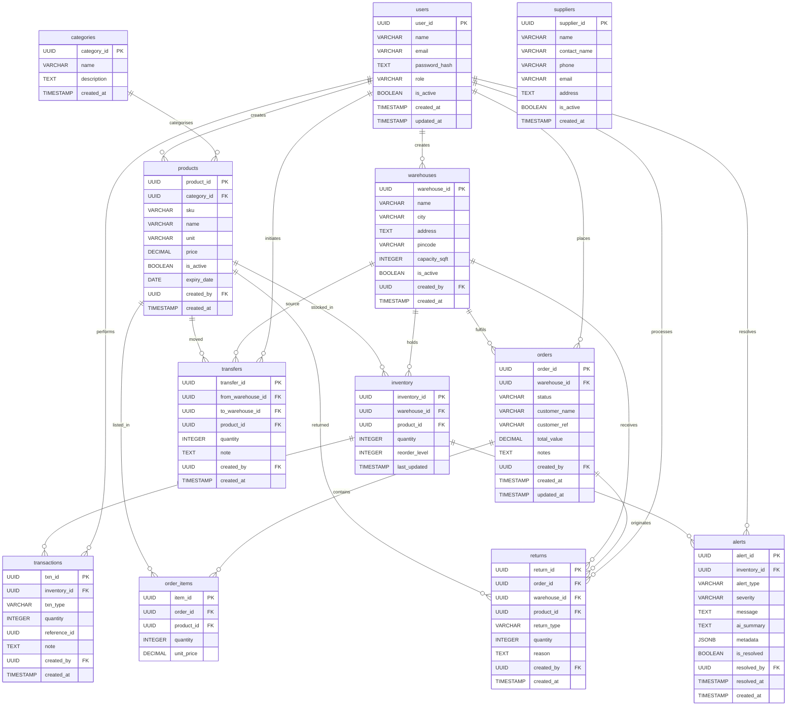

# InvenIQ — ER Diagram

Paste the code block below at **[mermaid.live](https://mermaid.live)** → click "Copy" → Export as PNG or SVG.



---

## How to get the image

**Option 1 — Online (easiest)**
1. Go to [mermaid.live](https://mermaid.live)
2. Paste the code block above
3. Click **Export → PNG** or **SVG**

**Option 2 — VS Code**
Install the **Markdown Preview Mermaid Support** extension, then open this file and hit `Ctrl+Shift+V`

**Option 3 — CLI**
```bash
npm install -g @mermaid-js/mermaid-cli
mmdc -i er_diagram.md -o er_diagram.png -w 2400
```

---

## Table Summary

| Table | Purpose |
|---|---|
| `categories` | Product categories |
| `users` | Auth + RBAC (admin/manager/staff/viewer) |
| `warehouses` | Physical storage locations |
| `suppliers` | Vendor/supplier directory |
| `products` | Product catalog with SKU + pricing |
| `inventory` | Stock levels per product per warehouse |
| `transactions` | Every stock movement (in/out/transfer/return) |
| `orders` | Customer/restock orders |
| `order_items` | Line items inside each order |
| `returns` | Customer or supplier returns |
| `transfers` | Stock moved between warehouses |
| `alerts` | AI-generated restock + anomaly alerts |
